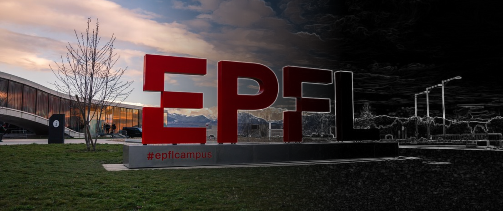

# The image analysis field guide

**Essential toolkit to get started in scientific image analysis.**

Welcome! Use this field guide to quickly find the information you need to tackle your scientific image analysis challenges.

## 🔖 Getting started

New to image analysis? These short guides will help you start off on the right foot.

- [A recipe for success in image analysis](./sections/getting_started/pages/recipe_success.md)
- [Setup for scientific image analysis using Python](./sections/getting_started/pages/python_setup.md)

## 🚀 Starter packs

We’ve curated resources and grouped them by topic.

````{grid} 1 1 2 3
```{grid-item-card}
:link: ./sections/starter_packs/packs/image-denoising/page.html
:img-top: ./images/denoising_tm.png
:text-align: center
Image denoising
```
```{grid-item-card}
:img-top: ./images/segmentation_tm.png
:link: ./sections/starter_packs/packs/image-segmentation/page.html
:text-align: center
Image segmentation
```
```{grid-item-card}
:link: ./sections/starter_packs/packs/image-registration/page.html
:img-top: ./images/registration_tm.png
:text-align: center
Image registration
```
````
````{grid} 1 1 2 3
```{grid-item-card}
:link: ./sections/starter_packs/packs/detection-and-tracking/page.html
:img-top: ./images/tracking_tm.png
:text-align: center
Detection and tracking
```
```{grid-item-card}
:link: ./sections/starter_packs/packs/image-data-visualization/page.html
:img-top: ./images/visualization_tm.png
:text-align: center
Image data visualization
```
```{grid-item-card}
:link: ./sections/starter_packs/packs/performance-optimization/page.html
:img-top: ./images/performance_tm.png
:text-align: center
Performance optimization
```
````

## 📚 Exploring further

Browse our collections of online resources, python examples, and software tools related to image analysis.

- [Online resources](./sections/exploring_further/online_resources/page.md)
- [Notebooks case studies](./sections/exploring_further/notebook_case_studies/page.md)
- [Software tools database](./sections/exploring_further/software_tools/page.md)

## 🧑‍🤝‍🧑 Join the community

Join us.


## 🤝 Contribute

Send an email to imaging@epfl.ch if you’d like to contribute to this material. We’d be happy to receive your suggestions and to know more about the topics you are interested in.
