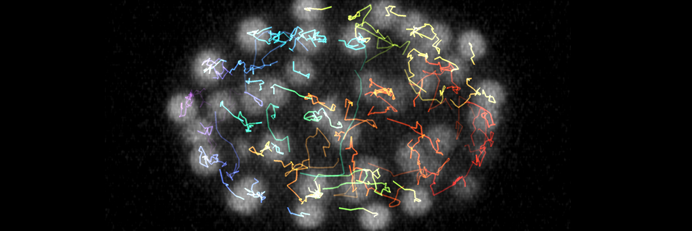

---
jupytext:
  text_representation:
    extension: .md
    format_name: myst
    format_version: 0.13
    jupytext_version: 1.16.0
kernelspec:
  display_name: image-analysis-field-guide
  language: python
  name: python3
---


# 🐾 Detection and tracking

Objects of interest can be detected via keypoints, bounding boxes, shapes (e.g. lines, circles), or segmentation masks. In timeseries (movies), following objects across frames is known as tracking.

## 🌐 Online resources

```{code-cell} ipython3
:tags: [remove-input]

import pandas as pd
from itables import init_notebook_mode
from itables import show
from pathlib import Path

init_notebook_mode(all_interactive=True, connected=True)

df = pd.read_csv(Path.cwd().parents[4] / 'db' / 'online_resources.csv')

df["Name"] = [
    '<a href="{}">{}</a>'.format(link, name)
    for link, name in zip(df["Link"], df["Name"])
]

mask = df['Keywords'].str.contains('|'.join(['Object detection', 'Tracking']), na=False)
filtered_df = df[mask].copy()
filtered_df.drop(['Link', 'Keywords'], axis='columns', inplace=True)

show(
    filtered_df,
    classes="display compact", 
    columnDefs=[
        {"width": "100%", "targets": [0]},
        {"className": "dt-left", "targets": [0]}
    ],
    style="width:100%;margin:auto",
    paging=False,
    showIndex=False,
    dom="tr"
)
```

## 💡 Notebook case studies

```{code-cell} ipython3
:tags: [remove-input]

df = pd.read_csv(Path.cwd().parents[4] / 'db' / 'notebook_case_studies.csv')

df["Title"] = [
    '<a href="../../../exploring_further/notebook_case_studies/notebooks/{}">{}</a>'.format(link, name)
    for link, name in zip(df["Link"], df["Title"])
]

df["Image"] = [
    ''.format(image)
    for image in df["Image"]
]

mask = df['Keywords'].str.contains('|'.join(['Object detection', 'Tracking']), na=False)
df = df[mask].copy()
df.drop(['Link', 'Keywords', 'Description'], axis='columns', inplace=True)

show(
    df, 
    classes="display compact", 
    columnDefs=[
        {"className": "dt-left", "targets": [0]}
    ],
    style="width:100%;margin:auto",
    paging=False,
    showIndex=False,
    dom="tr"
)
```

## 🛠️ Software tools

```{code-cell} ipython3
:tags: [remove-input]

df = pd.read_csv(Path.cwd().parents[4] / 'db' / 'software_tools.csv')

df["Software tool"] = [
    '<a href="{}">{}</a>'.format(link, name)
    for link, name in zip(df["Homepage"], df["Software tool"])
]

df["Technology"] = [
    ''.join(['<button class="btn btn-light btn-xs" onclick="insertText(this)" style="padding: 1px; margin: 4px 2px; font-size: 12px;">{}</button>'.format(keyword) for keyword in str(keywords).split(', ')])
    for keywords in df["Technology"]
]

df["Keywords"] = [
    ''.join(['<button class="btn btn-light btn-xs" onclick="insertText(this)" style="padding: 1px; margin: 4px 2px; font-size: 12px;">{}</button>'.format(keyword) for keyword in str(keywords).split(', ')])
    for keywords in df["Keywords"]
] + df["Technology"]

df.drop('Technology', axis='columns', inplace=True)


mask = df['Used for'].str.contains('|'.join(['Object detection', 'Tracking']), na=False)
filtered_df = df[mask].copy()
filtered_df.drop(['Homepage', 'Tested and approved by the authors', 'Used for'], axis='columns', inplace=True)

show(
    filtered_df,
    classes="display compact", 
    columnDefs=[
        {"className": "dt-left", "targets": "_all"}
    ],
    style="width:100%;margin:auto",
    paging=False,
    showIndex=False,
)
```