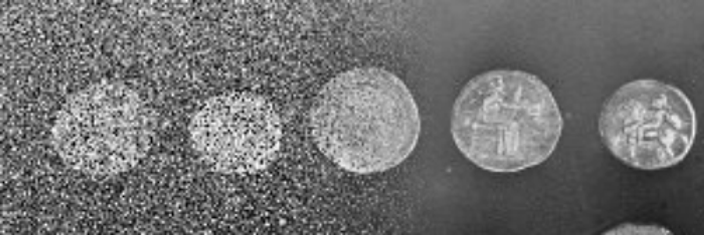

---
jupytext:
  text_representation:
    extension: .md
    format_name: myst
    format_version: 0.13
    jupytext_version: 1.16.0
kernelspec:
  display_name: image-analysis-field-guide
  language: python
  name: python3
---


# 🪄 Image denoising

Image denoising is used to generate images with high visual quality, in which structures are easily distinguishable, and noisy pixels are removed. Denoised images are often more amendable to thresholding for [segmentation](../image-segmentation/page.md).

## 🌐 Online resources

```{code-cell} ipython3
:tags: [remove-input]

import pandas as pd
from itables import init_notebook_mode
from itables import show

init_notebook_mode(all_interactive=True)

df = pd.read_csv('../../../exploring_further/online_resources/online_resources.csv')

df["Name"] = [
    '<a href="{}">{}</a>'.format(link, name)
    for link, name in zip(df["Link"], df["Name"])
]

df.drop('Link', axis='columns', inplace=True)

filtered_df = df[df['Keywords'].str.contains('Image denoising', na=False)]

show(filtered_df, classes="display compact", paging=False)
```

## 💡 Notebook case studies

```{code-cell} ipython3
:tags: [remove-input]

df = pd.read_csv('../../../exploring_further/notebook_case_studies/notebook_case_studies.csv')

df["Title"] = [
    '<a href="./{}">{}</a>'.format(link, name)
    for link, name in zip(df["Link"], df["Title"])
]

df["Image"] = [
    ''.format(image)
    for image in df["Image"]
]

df = df[df['Keywords'].str.contains('Image denoising', na=False)]
df.drop(['Link', 'Keywords'], axis='columns', inplace=True)

show(df, classes="display compact", paging=False)
```

## 🛠️ Software tools

```{code-cell} ipython3
:tags: [remove-input]

df = pd.read_csv('../../../exploring_further/software_tools/software_tools.csv')

df["Software tool"] = [
    '<a href="{}">{}</a>'.format(link, name)
    for link, name in zip(df["Homepage"], df["Software tool"])
]

df.drop(['Homepage', 'Tested and approved by the authors'], axis='columns', inplace=True)

filtered_df = df[df['Used for'].str.contains('Image denoising', na=False)]

show(filtered_df, classes="display compact", paging=False)
```