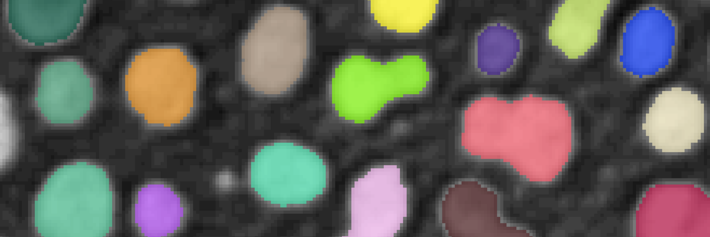

---
jupytext:
  text_representation:
    extension: .md
    format_name: myst
    format_version: 0.13
    jupytext_version: 1.16.0
kernelspec:
  display_name: image-analysis-field-guide
  language: python
  name: python3
---


# ✂️ Image segmentation

Image segmentation aims to produce a segmentation mask that identifies a particular class or object. Image segmentation can be approached by classical techniques such as thresholding, weakly supervised learning, or deep learning.

## 🌐 Online resources

```{code-cell} ipython3
:tags: [remove-input]

from itables import init_notebook_mode
from pathlib import Path
import sys
sys.path.append(str(Path.cwd().parents[3]))
from helpers import *

init_notebook_mode(all_interactive=True, connected=True)

tags = ["Image segmentation"]

df = filter_online_resources(tags)
show_online_resources(df)
```

## 💡 Notebook case studies

```{code-cell} ipython3
:tags: [remove-input]

df = filter_notebook_case_studies(tags)
show_notebook_case_studies(df)
```

## 🛠️ Software tools

```{code-cell} ipython3
:tags: [remove-input]

df = filter_software_tools(tags)
show_software_tools(df)
```